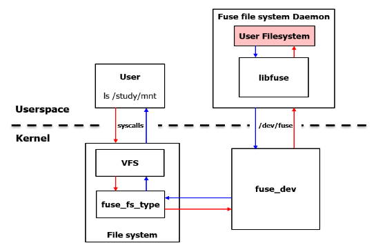
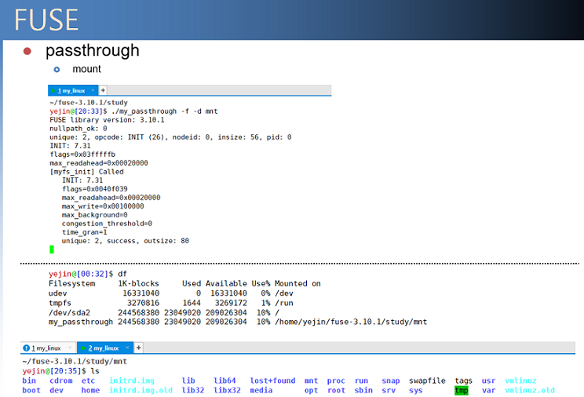

# FUSE-filesystem study
FUSE를 이용한 내 파일 시스템 만들기

## 1. FUSE란?
 From the [official repository](https://github.com/libfuse/libfuse)
>  FUSE는 user-space에서 파일 시스템을 개발하는데 사용되는 프레임워크이다. User-space에서는
수많은 툴과 라이브러리를 이용하여 커널단에 비해 파일 시스템을 쉽게 개발할 수 있다. FUSE는 현재
가장 일반적으로 사용되며, 현재 100개 이상의 FUSE 기반 파일 시스템이 나와있다.

## 2. FUSE Structure



FUSE는 kernel의 *FUSE* 모듈과 user-space의 FUSE daemon, 라이브러리 *libfuse*로 구성된다. 


*FUSE* 모듈은 load된 후 파일시스템 타입(fuse, fuseblk, fusectl)과 /dev/fuse character 디바이스를 등록한다. 
그 이후 사용자 application이 FUSE filesystem이 mount된 폴더를 대상으로 system call을 호출하면 
VFS를 지나 /dev/fuse로 전달된다. 그 후 FUSE 데몬은 /dev/fuse에서 요청을 읽어 수행하고, 수행이 끝나면 
드라이버에 요청이 끝났음을 전달하고 이는 application으로 보내진다.

#### *Libfuse* 설치
>https://github.com/libfuse/libfuse/releases
---
## 3. How to use my file system

디렉토리로 들어가서 mount할 지점인 폴더를 생성
```
$ cd study; mkdir <mount point>
```
컴파일 후 프로그램 실행
```
$ gcc -Wall my_passthrough.c `pkg-config fuse3 --cflags --libs` -o my_passthrough
$ ./my_passthrough -d -f <mount point>
```
다른 shell 창에서 ```mount point```로 들어가서 작업 수행

---
#### Flags to `gcc`

Several flags are passed to `gcc` while compiling FFS. Here is a table to understand their meaning.

| FLAG | MEANING       | CONSEQUENCE |
|:----:|:-------------:|:-----------:|
|-Wall|Turn on warnings| 모든 경고 표시|
|\`pkg-config fuse3 --cflags --libs\`|Required| 컴파일과 링크에 대한 정보 제공, FUSE3 버전 사용|


#### Flags to `./my_passthrough`

| FLAG | MEANING       | CONSEQUENCE |
|:----:|:-------------:|:-----------:|
|-d|Debug mode| FUSE에 의해서 추가적인 디버깅 정보가 표시됨|
|-f|Run in foreground| -f 플래그가 없으면 my_passthrough는 백그라운드 데몬으로 돌아감|

## example output  


my_passthrough: mirrors the file system hierarchy, starting at the root file system

-----------------------------------------------
## Contact
**Dankook University**

**Yejin Han**
E-MAIL : _hyj0225@dankook.ac.kr_
